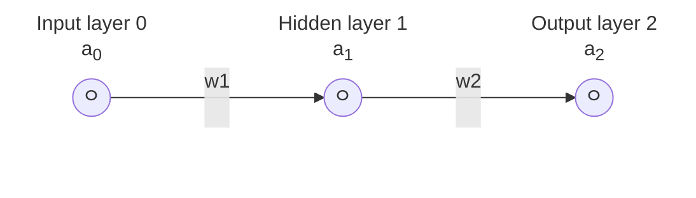
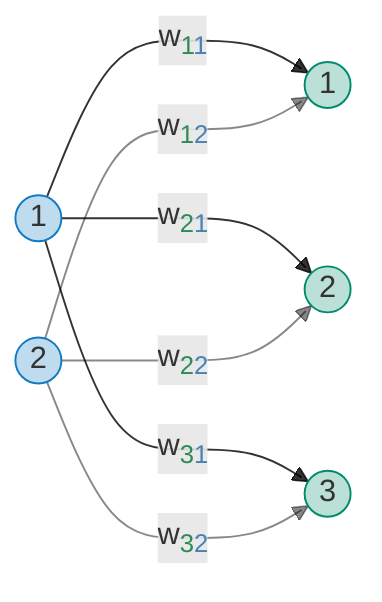

## Reference

This project is being built upon my experience building out [another neural network
implementation from scratch](https://github.com/MadLittleMods/zig-ocr-neural-network).
That project also has it's own set of [developer
notes](https://github.com/MadLittleMods/zig-ocr-neural-network/blob/main/dev-notes.md)
which might be of interest to read.

Here are some external resources that I am building upon:

 - Neural Networks series by The Independent Code (Omar Aflak), https://www.youtube.com/playlist?list=PLQ4osgQ7WN6PGnvt6tzLAVAEMsL3LBqpm
    - Project repo: https://github.com/TheIndependentCode/Neural-Network
 - How to Create a Neural Network (and Train it to Identify Doodles) by Sebastian Lague, https://www.youtube.com/watch?v=hfMk-kjRv4c
    - Project repo: https://github.com/SebLague/Neural-Network-Experiments
 - Deep learning series by 3Blue1Brown
    - But what is a neural network? | Chapter 1, Deep learning by, https://www.youtube.com/watch?v=aircAruvnKk
    - Gradient descent, how neural networks learn | Chapter 2, Deep learning, https://www.youtube.com/watch?v=IHZwWFHWa-w
    - What is backpropagation really doing? | Chapter 3, Deep learning, https://www.youtube.com/watch?v=Ilg3gGewQ5U
    - Backpropagation calculus | Chapter 4, Deep learning, https://www.youtube.com/watch?v=tIeHLnjs5U8
 - Andrej Karpathy's video on *The spelled-out intro to neural networks and backpropagation: building micrograd*, https://www.youtube.com/watch?v=VMj-3S1tku0
    - Project repo: https://github.com/karpathy/micrograd
    - Zig port: https://github.com/nurpax/zigrograd/

## Math

In order to explain and lay out the math equations we're going to be using, let's use this
ridiculously simple neural network that has just 3 nodes connected by 2 weights.

### Forward propagation

Forward propagation just means that we're going to feed the input through each layer in
the network to the next until we get the output in the final layer.

Some variable explanations:

 - $`a0`$: The input to the network. This is often alternatively labeled as $`x`$.
   Labeling the input as an "activation" is a bit strange since it hasn't been through
   our activation function but it just makes our notation a bit more consistent.
 - $`w_1`$, $`w_2`$: The weight of the connection
 - $`b_1`$, $`b_2`$: The bias of the node

Equations:

 - $`z_1 = a_0*w_1 + b_1`$: The weighted input to the 1st layer
 - $`a_1 = ActivationFunction(z_1)`$: activation 1 (the output from layer 1)
 - $`z_2 = a_1*w_2 + b_2`$: The weighted input to the 2nd layer
 - $`a_2 = ActivationFunction(z_2)`$: activation 2 (the output from layer 2)
 - $`c = CostFunction(a_2, \verb|expected_output|)`$: Cost (also known as loss)
   ($`\verb|expected_output|`$ is often labeled as $`y`$)

Since this library separates the activation functions as their own layers, the
`DenseLayer` only has to deal with $`z = w * x + b`$. In order for the equation to make
more sense in the context of the `DenseLayer`, the weighted input ($`z`$) is just
renamed to $`y`$ for simplicity of referring to the generic "output" of the layer.

 - $`y_1 = w_1 * x_1 + b_1`$
 - $`y_2 = w_2 * x_2 + b_2`$

After each `DenseLayer`, we use a `ActivationLayer` to apply the activation function to
the output of the previous layer. We also rename the activation $`a`$ to $`y`$ to
refer to the generic "output" of the layer.

 - $`y_1 = \verb|ActivationFunction|(x_1)`$
 - $`y_2 = \verb|ActivationFunction|(x_2)`$

Separating these two layers types allows the math to be a bit more sane to reason about
when you're staring at the code especially when it comes to backpropagation.

### Backward propagation

With backwards propagation, our goal is to minimize the cost function which is achieved
by adjusting the weights and biases. In order to find which direction we should step in
order to adjust the weights and biases, we need to find the slope of the cost function
with respect to the weights and biases. The pure math way to find the slope of a
function is to take the derivative (same concepts that you learned in calculus class).
If we keep taking these steps downhill, we will eventually reach a local minimum of the cost
function (where the slope is 0) which is the goal. This process is called gradient descent.

If we keep these steps proportional to the slope, then when the slope is flattening out
approaching a local minimum, our steps get smaller and smaller which helps us from
overshooting. This is also why our learn rate is some small number so we don't overshoot
and bounce around the local minimum valley.

The pattern is the same for all `Layer.backward(...)` methods; we're given the partial
derivatives of the cost/loss/error ($`C`$) with respect to the *outputs* ($`y`$) of the
layer ($`\frac{\partial C}{\partial y}`$, known as the `output_gradient` in the code);
and we need to return the derivative of the cost/loss/error with respect to the *inputs*
($`x`$) of that layer ($`\frac{\partial C}{\partial x}`$, know as the `input_gradient`
in the code). We also need to know how to update any parameters in the layer (e.g.
weights and biases) so we also need to find the partial derivative of the
cost/loss/error with respect to the weights ($`\frac{\partial C}{\partial w}`$) and
biases ($`\frac{\partial C}{\partial b}`$).

In order to find how we go from our given $`\frac{\partial C}{\partial y}`$ to our other
desired partial derivatives ($`\frac{\partial C}{\partial x}`$, $`\frac{\partial
C}{\partial w}`$, $`\frac{\partial C}{\partial b}`$), we can use the chain rule. I won't
be going over the chain-rule here because it's better explained by these videos:

 - https://www.youtube.com/watch?v=pauPCy_s0Ok&t=683s
 - https://www.youtube.com/watch?v=tIeHLnjs5U8&t=129s

The code also tries to explain where things are coming from so you might just want to
jump in as well.

Partial derivative of the cost with respect to the weight ($`\frac{\partial C}{\partial w}`$):
$`
\begin{aligned}
\frac{\partial C}{\partial w} &= \frac{\partial C}{\partial y} &\times& \frac{\partial y}{\partial w}\\
\\&= \frac{\partial C}{\partial y} &\times& x
\end{aligned}
`$

 - If we want to find the partial derivative of the output ($`y`$) with respect to the
   weight ($`w`$) -> ($`\frac{\partial y}{\partial w}`$). Given the forward equation
   from above $`y = x * w + b`$, to find $`\frac{\partial y}{\partial w}`$, we need to
   see how much a nudge to the weight ($`w`$), will affect the output $`y`$. Looking at
   the equation, if we nudge $`w`$, the output $`y`$ will change by the input ($`x`$).

Partial derivative of the cost with respect to the bias ($`\frac{\partial C}{\partial b}`$):
$`
\begin{aligned}
\frac{\partial C}{\partial b} &= \frac{\partial C}{\partial y} &\times& \frac{\partial y}{\partial b}\\
\\&= \frac{\partial C}{\partial y} &\times& 1
\end{aligned}
`$

 - We can apply the same logic for the partial derivative of the output ($`y`$) with
   respect to the bias ($`b`$) -> ($`\frac{\partial y}{\partial b}`$). If we nudge the
   bias ($`b`$), the output ($`y`$) will change by the same amount so $`\frac{\partial
   y}{\partial x}`$ = 1.

Partial derivative of the cost with respect to the inputs ($`\frac{\partial C}{\partial x}`$):
$`
\begin{aligned}
\frac{\partial C}{\partial x} &= \frac{\partial C}{\partial y} &\times& \frac{\partial y}{\partial x}\\
\\&= \frac{\partial C}{\partial y} &\times& w
\end{aligned}
`$

 - When using our ridiculously simple neural network example, the partial derivative of
   the output ($`y`$) with respect to the input ($`x`$) -> ($`\frac{\partial y}{\partial
   x}`$) is just the weight ($`w`$) since $`y = x * w + b`$.
 - But this changes when there are multiple nodes in the layer. See the section below
   about multiple nodes per layer.

### Expanding to multiple nodes per layer

Mermaid source

When expanding the network with more nodes per layer, since it's a fully connected
`DenseLayer`, we see something more like the following in the forward pass:

Where $`j`$ is the node in the outgoing layer and $`i`$ is the node in the incoming layer:
$`
{\begin{cases}
   y_1 = w_{11} * x_1 + w_{12} * x_2 + \dots + w_{1i} * x_i + b_1\\
   y_2 = w_{21} * x_1 + w_{22} * x_2 + \dots + w_{2i} * x_i + b_2\\
   \vdots\\
   y_j = w_{j1} * x_1 + w_{j2} * x_2 + \dots + w_{ji} * x_i + b_j\\
\end{cases}}
`$

And then for the backward pass, the partial derivative vectors look like the following:

Partial derivative of the cost with respect to the inputs ($`\frac{\partial C}{\partial x}`$):
$`
\begin{aligned}
\frac{\partial C}{\partial y} =
\begin{bmatrix}
   \frac{\partial C}{\partial y_1}\\
   \frac{\partial C}{\partial y_2}\\
   \vdots\\
   \frac{\partial C}{\partial y_j}\\
\end{bmatrix}
\quad\quad\longrightarrow\quad\quad
\frac{\partial C}{\partial x} &=
\begin{bmatrix}
   \frac{\partial C}{\partial x_1}\\
   \frac{\partial C}{\partial x_2}\\
   \vdots\\
   \frac{\partial C}{\partial x_j}\\
\end{bmatrix}
\\
\\&= \begin{bmatrix}
   \frac{\partial C}{\partial y_1}w_{11} + \frac{\partial C}{\partial y_2}w_{21} + \dots + \frac{\partial C}{\partial y_j}w_{j1}\\
   \frac{\partial C}{\partial y_1}w_{12} + \frac{\partial C}{\partial y_2}w_{22} + \dots + \frac{\partial C}{\partial y_j}w_{j2}\\
   \vdots\\
   \frac{\partial C}{\partial y_1}w_{1i} + \frac{\partial C}{\partial y_2}w_{2i} + \dots + \frac{\partial C}{\partial y_j}w_{ji}\\
\end{bmatrix}
\end{aligned}
`$

Partial derivative of the cost with respect to the weight ($`\frac{\partial C}{\partial w}`$):
$`
\begin{aligned}
\frac{\partial C}{\partial y} =
\begin{bmatrix}
   \frac{\partial C}{\partial y_1}\\
   \frac{\partial C}{\partial y_2}\\
   \vdots\\
   \frac{\partial C}{\partial y_j}\\
\end{bmatrix}
\quad\quad\longrightarrow\quad\quad
\frac{\partial C}{\partial w} &=
\begin{bmatrix}
   \frac{\partial C}{\partial w_{11}} & \frac{\partial C}{\partial w_{12}} & \dots & \frac{\partial C}{\partial w_{1i}}\\
   \frac{\partial C}{\partial w_{21}} & \frac{\partial C}{\partial w_{22}} & \dots & \frac{\partial C}{\partial w_{2i}}\\
   \vdots & \vdots & \ddots & \vdots\\
   \frac{\partial C}{\partial w_{j1}} & \frac{\partial C}{\partial w_{j2}} & \dots & \frac{\partial C}{\partial w_{ji}}\\
\end{bmatrix}
\\
\\&= \begin{bmatrix}
   \frac{\partial C}{\partial y_1}\frac{\partial y_1}{\partial w_{12}} + \frac{\partial C}{\partial y_2}\frac{\partial y_2}{\partial w_{12}} + \dots + \frac{\partial C}{\partial y_j}\frac{\partial y_j}{\partial w_{1i}}\\
   \frac{\partial C}{\partial y_1}\frac{\partial y_1}{\partial w_{21}} + \frac{\partial C}{\partial y_2}\frac{\partial y_2}{\partial w_{22}} + \dots + \frac{\partial C}{\partial y_j}\frac{\partial y_j}{\partial w_{2i}}\\
   \vdots\\
   \frac{\partial C}{\partial y_1}\frac{\partial y_1}{\partial w_{j1}} + \frac{\partial C}{\partial y_2}\frac{\partial y_2}{\partial w_{j2}} + \dots + \frac{\partial C}{\partial y_j}\frac{\partial y_j}{\partial w_{ji}}\\
\end{bmatrix}
\\
\\&= \begin{bmatrix}
   \frac{\partial C}{\partial y_1}x_1 & \frac{\partial C}{\partial y_1}x_2 & \dots & \frac{\partial C}{\partial y_1}x_i\\
   \frac{\partial C}{\partial y_2}x_1 & \frac{\partial C}{\partial y_2}x_2 & \dots & \frac{\partial C}{\partial y_2}x_i\\
   \vdots & \vdots & \ddots & \vdots\\
   \frac{\partial C}{\partial y_j}x_1 & \frac{\partial C}{\partial y_j}x_2 & \dots & \frac{\partial C}{\partial y_j}x_i\\
\end{bmatrix}
\end{aligned}
`$

Partial derivative of the cost with respect to the bias ($`\frac{\partial C}{\partial b}`$):
$`
\begin{aligned}
\frac{\partial C}{\partial y} =
\begin{bmatrix}
   \frac{\partial C}{\partial y_1}\\
   \frac{\partial C}{\partial y_2}\\
   \vdots\\
   \frac{\partial C}{\partial y_j}\\
\end{bmatrix}
\quad\quad\longrightarrow\quad\quad
\frac{\partial C}{\partial b} &=
\begin{bmatrix}
   \frac{\partial C}{\partial b_1}\\
   \frac{\partial C}{\partial b_2}\\
   \vdots\\
   \frac{\partial C}{\partial b_j}\\
\end{bmatrix}
\\
\\&= \begin{bmatrix}
   \frac{\partial C}{\partial y_1}\frac{\partial y_1}{\partial b_1} + \frac{\partial C}{\partial y_2}\frac{\partial y_2}{\partial b_1} + \dots + \frac{\partial C}{\partial y_j}\frac{\partial y_j}{\partial b_1}\\
   \frac{\partial C}{\partial y_1}\frac{\partial y_1}{\partial b_2} + \frac{\partial C}{\partial y_2}\frac{\partial y_2}{\partial b_2} + \dots + \frac{\partial C}{\partial y_j}\frac{\partial y_j}{\partial b_2}\\
   \vdots\\
   \frac{\partial C}{\partial y_1}\frac{\partial y_1}{\partial b_j} + \frac{\partial C}{\partial y_2}\frac{\partial y_2}{\partial b_j} + \dots + \frac{\partial C}{\partial y_j}\frac{\partial y_j}{\partial b_j}\\
\end{bmatrix}
\\
\\&= \begin{bmatrix}
   \frac{\partial C}{\partial y_1}1 + \frac{\partial C}{\partial y_2}0 + \dots + \frac{\partial C}{\partial y_j}0\\
   \frac{\partial C}{\partial y_1}0 + \frac{\partial C}{\partial y_2}1 + \dots + \frac{\partial C}{\partial y_j}0\\
   \vdots\\
   \frac{\partial C}{\partial y_1}0 + \frac{\partial C}{\partial y_2}0 + \dots + \frac{\partial C}{\partial y_j}1\\
\end{bmatrix}
\\
\\&= \begin{bmatrix}
   \frac{\partial C}{\partial y_1}\\
   \frac{\partial C}{\partial y_2}\\
   \vdots\\
   \frac{\partial C}{\partial y_j}\\
\end{bmatrix}
\end{aligned}
`$

### Activation functions

#### Single-input activation functions like (`Relu`, `LeakyRelu`, `ELU`, `Sigmoid`, `Tanh`)

Single-input activation only use one input to produce an output.

When we take a derivative of a single-input activation function, we can simply just take
the derivative of the activation function with respect to the input and multiply the
scalar value with whatever we need to afterwards without thinking about it.

---

Note: You might only care about this section if you're trying to figure out why we need
a `jacobian_row` function for `SoftMax` or are trying to understand the code in
`calculateOutputLayerShareableNodeDerivatives(...)`. It's mainly just to illustrate a
point for comparison with the derivative of multi-input activation functions like
`SoftMax` explained in the section below.

We don't need to specify a `jacobian_row` function for single-input activation functions. We
can simply use the `derivative` with a single-input activation functions.

This characteristic can be conveyed by using a Jacobian matrix to get the derivative of
the activation function with respect to the `inputs` given to the function for each node
in the layer. The matrix ends up being sparse with only the diagonal values being
non-zero. (each row in the matrix represents the partial derivative of the activation
function with respect to the `inputs` of each node in the layer)

$`
\verb|inputs| =
\begin{bmatrix}
x_1\\
x_2\\
x_3\\
x_4\\
\end{bmatrix}
`$

Let's use the `Sigmoid` activation function as an example:

$`y_i = \verb|Sigmoid|(x_i) = \frac{1}{1 + exp(-x_i)}`$

And then if we want to find the partial derivative of the activation function of $`y_i`$
with respect to all of the `inputs` of each node in the layer ($`\frac{\partial
y_i}{\partial x_k}`$), we can use a Jacobian matrix. To calculate the first element,
it's comes out to a normal derivative since $`x_1`$ is used in the function.

$`\frac{\partial y_1}{\partial x_1} 1 / (1 + exp(-x_1)) = y_1(1 - y_1)`$

Then to fill out the rest of the first row in the matrix, we find partial derivitive of
the activation function with respect to $`x_2`$; Because we don't see any $`x_2`$ in the
equation, changing $`x_2`$ has no effect on the output of the function. So the partial
derivative is 0. Same thing happens when we look for $`x_3`$, and $`x_4`$.

$`\frac{\partial y_1}{\partial x_2} 1 / (1 + exp(-x_1)) = 0`$

$`\frac{\partial y_1}{\partial x_3} 1 / (1 + exp(-x_1)) = 0`$

$`\frac{\partial y_1}{\partial x_4} 1 / (1 + exp(-x_1)) = 0`$

If we repeat this process for each row, the Jacobian matrix ends up looking like the
following sparse matrix with only the diagonal $`k = i`$ elements as non-zero values:

$`
\begin{bmatrix}
\frac{\partial y_1}{\partial x_1} & 0 & 0 & 0\\
0 & \frac{\partial y_2}{\partial x_2} & 0 & 0\\
0 & 0 & \frac{\partial y_3}{\partial x_3} & 0\\
0 & 0 & 0 & \frac{\partial y_4}{\partial x_4}\\
\end{bmatrix}
`$

So for example during backpropagation, when we multiply the cost vector by this
Jacobian, most of the terms just drop away because they're multiplied by 0 and we're
just left with the diagonal terms anyway. And is equivalent to just multiplying the cost
vector by the result of the `deriviative` function for each node which involves a lot
less computation (efficient shortcut).

#### Softmax

Sources:

 - Special shoutout to Hans Musgrave ([@hmusgrave](https://github.com/hmusgrave)) for
   the immense amount of help to get my head around these concepts as I got stuck
   through this process.
 - [*Softmax Layer from Scratch | Mathematics & Python
   Code*](https://youtu.be/AbLvJVwySEo?si=uhGygTuChG8xMjGV&t=181) by The Independent
   Code
 - Dahal, Paras. (Jun 2017). [Softmax and Cross Entropy Loss. Paras Dahal.](https://www.parasdahal.com/softmax-crossentropy#derivative-of-softmax)

Given the SoftMax equation:
$`
y_i = S(x)_i = \frac{e^{x_i}}{\sum\limits_{j=1}^{n} e^{x_j}}
= \frac{\verb|exp_input|}{\verb|exp_sum|}
`$

We can use the quotient rule ($`(\frac{u}{v})' = \frac{u'v - uv'}{v^2}`$) to
find the derivative of the SoftMax equation with respect to a
specific element of the input vector ($`x_k`$):

For convenience, let $`\delta_{ik}`$ denote a symbol meaning $`1`$ if $`k = i`$ and $`0`$ otherwise.

$`
\begin{aligned}
\delta_{ik} &= {\begin{cases}
    1 & \text{if } k = i\\
    0 & \text{otherwise.}
\end{cases}}
\\
\\
\frac{\partial y_i}{\partial x_k} = \frac{\partial S(x)_i}{\partial x_k} &=
\frac{
    \delta_{ik}e^{x_i}(\sum\limits_{j=1}^{n} e^{x_j}) - e^{x_i}e^{x_k}
}
{
    (\sum\limits_{j=1}^{n} e^{x_j})^2
}
\\&=
y_i\delta_{ik} - y_iy_k
\end{aligned}
`$

Or if we want to split up that delta (δ) condition into two separate equations, we will get:

$`\begin{aligned}
\text{If } k = i \text{:}
\\
\frac{\partial y_i}{\partial x_k} &=
\frac{
    e^{x_i}(\sum\limits_{j=1}^{n} e^{x_j}) - e^{x_i}e^{x_i}
}
{
    (\sum\limits_{j=1}^{n} e^{x_j})^2
}
= \frac{\verb|exp_input| * \verb|exp_sum| - \verb|exp_input| * \verb|exp_input|}{\verb|exp_sum| * \verb|exp_sum|}
\\&=
\frac{e^{x_i}}{\sum\limits_{j=1}^{n} e^{x_j}} -
(\frac{e^{x_i}}{\sum\limits_{j=1}^{n} e^{x_j}})^2
\\&=
y_i - (y_i)^2
\\&=
y_i(1 - y_i)
\end{aligned}`$

$`\begin{aligned}
\text{If } k \ne i \text{:}
\\
\frac{\partial y_i}{\partial x_k} &=
e^{x_i}\frac{-e^{x_k}}{(\sum\limits_{j=1}^{n} e^{x_j})^2}
\\&=
-\frac{e^{x_i}}{\sum\limits_{j=1}^{n} e^{x_j}}\frac{e^{x_k}}{\sum\limits_{j=1}^{n} e^{x_j}}
\\&=
-y_iy_k
\end{aligned}`$

Now we know how to calculate a single element of the derivative of the SoftMax function.
To calculate the full derivative of the SoftMax activation function, we can use a
Jacobian matrix. In the example, the `SoftMax` function uses 4 `inputs` which produces a
matrix that is 4 x 4.

$`\begin{bmatrix}
\frac{\partial y_1}{\partial x_1} & \frac{\partial y_1}{\partial x_2} & \frac{\partial y_1}{\partial x_3} & \frac{\partial y_1}{\partial x_4}\\
\frac{\partial y_2}{\partial x_1} & \frac{\partial y_2}{\partial x_2} & \frac{\partial y_2}{\partial x_3} & \frac{\partial y_2}{\partial x_4}\\
\frac{\partial y_3}{\partial x_1} & \frac{\partial y_3}{\partial x_2} & \frac{\partial y_3}{\partial x_3} & \frac{\partial y_3}{\partial x_4}\\
\frac{\partial y_4}{\partial x_1} & \frac{\partial y_4}{\partial x_4} & \frac{\partial y_4}{\partial x_3} & \frac{\partial y_4}{\partial x_4}\\
\end{bmatrix}`$

In the context of the code, the `derivative`/`jacobian_row` functions assemble a single row
of this matrix at a time. The row is specified by the `node_index` which ends up getting
passed in as the `input_index` with the activation functions.

If we just used the `derivative` function with `SoftMax`, we end up only calculating the
diagonals of the Jacobian matrix (we just return the single derivative where $`k = i`$
on that diagonal) and competely miss the off-diagonal terms (where $`k \ne i`$) which
will throw off how well our network learns (more inaccurate wandering during back
propagation) if we try to mix this in during backpropagation.

$`
\begin{bmatrix}
\frac{\partial y_1}{\partial x_1} & 0 & 0 & 0\\
0 & \frac{\partial y_2}{\partial x_2} & 0 & 0\\
0 & 0 & \frac{\partial y_3}{\partial x_3} & 0\\
0 & 0 & 0 & \frac{\partial y_4}{\partial x_4}\\
\end{bmatrix}
`$

In the context of backpropagation, we need to end up with a single value for each node
$`i`$. With a single-input activation function we just multiply the scalar return value
from activation function `derivative` by the partial derivative of the cost with respect
to the input of that node (($`\frac{\partial C}{\partial y_i}`$)).

But when using a multi-input activation function like `SoftMax`, we need to take dot
product the activation `jacobian_row` with the whole cost vector ($`\frac{\partial
C}{\partial y}`$). Remember, we're showing a whole matrix here, but the code just takes
it row by row (specified by the `node_index` which ends up getting passed in as the
`input_index` with the activation functions).

$`\begin{aligned}
\frac{\partial C}{\partial x} &=
\begin{bmatrix}
\frac{\partial y_1}{\partial x_1} & \frac{\partial y_1}{\partial x_2} & \frac{\partial y_1}{\partial x_3} & \frac{\partial y_1}{\partial x_4}\\
\frac{\partial y_2}{\partial x_1} & \frac{\partial y_2}{\partial x_2} & \frac{\partial y_2}{\partial x_3} & \frac{\partial y_2}{\partial x_4}\\
\frac{\partial y_3}{\partial x_1} & \frac{\partial y_3}{\partial x_2} & \frac{\partial y_3}{\partial x_3} & \frac{\partial y_3}{\partial x_4}\\
\frac{\partial y_4}{\partial x_1} & \frac{\partial y_4}{\partial x_4} & \frac{\partial y_4}{\partial x_3} & \frac{\partial y_4}{\partial x_4}\\
\end{bmatrix}
\cdot
\begin{bmatrix}
\frac{\partial C}{\partial y_1}\\
\frac{\partial C}{\partial y_2}\\
\frac{\partial C}{\partial y_3}\\
\frac{\partial C}{\partial y_4}\\
\end{bmatrix}
\end{aligned}`$

$`\begin{aligned}
\\&=
\begin{bmatrix}
\frac{\partial y_1}{\partial x_1} * \frac{\partial C}{\partial y_1} + \frac{\partial y_1}{\partial x_2} * \frac{\partial C}{\partial y_2} + \frac{\partial y_1}{\partial x_3} * \frac{\partial C}{\partial y_3} + \frac{\partial y_1}{\partial x_4} * \frac{\partial C}{\partial y_4}\\
\frac{\partial y_2}{\partial x_1} * \frac{\partial C}{\partial y_1} + \frac{\partial y_2}{\partial x_2} * \frac{\partial C}{\partial y_2} + \frac{\partial y_2}{\partial x_3} * \frac{\partial C}{\partial y_3} + \frac{\partial y_2}{\partial x_4} * \frac{\partial C}{\partial y_4}\\
\frac{\partial y_3}{\partial x_1} * \frac{\partial C}{\partial y_1} + \frac{\partial y_3}{\partial x_2} * \frac{\partial C}{\partial y_2} + \frac{\partial y_3}{\partial x_3} * \frac{\partial C}{\partial y_3} + \frac{\partial y_3}{\partial x_4} * \frac{\partial C}{\partial y_4}\\
\frac{\partial y_4}{\partial x_1} * \frac{\partial C}{\partial y_1} + \frac{\partial y_4}{\partial x_4} * \frac{\partial C}{\partial y_2} + \frac{\partial y_4}{\partial x_3} * \frac{\partial C}{\partial y_3} + \frac{\partial y_4}{\partial x_4} * \frac{\partial C}{\partial y_4}\\
\end{bmatrix}
\end{aligned}`$
